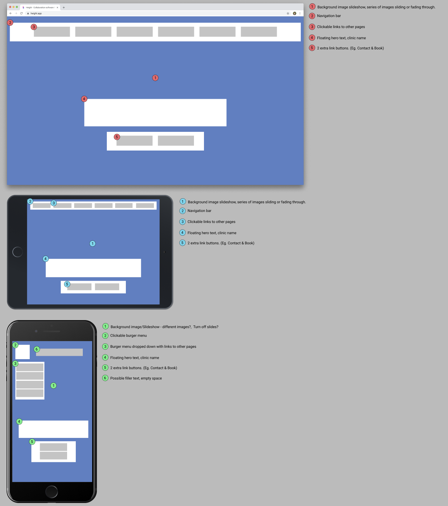
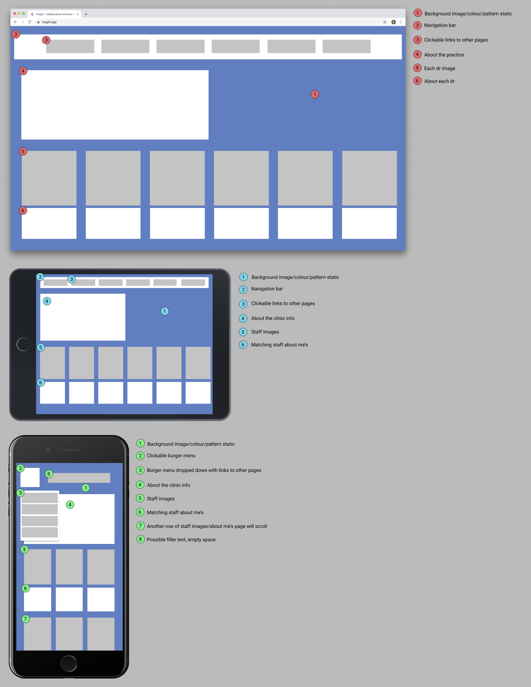
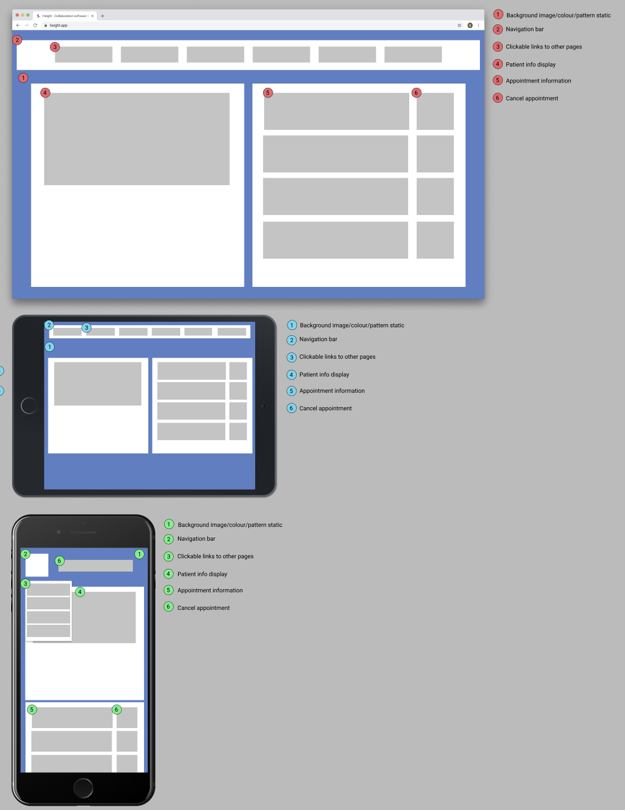
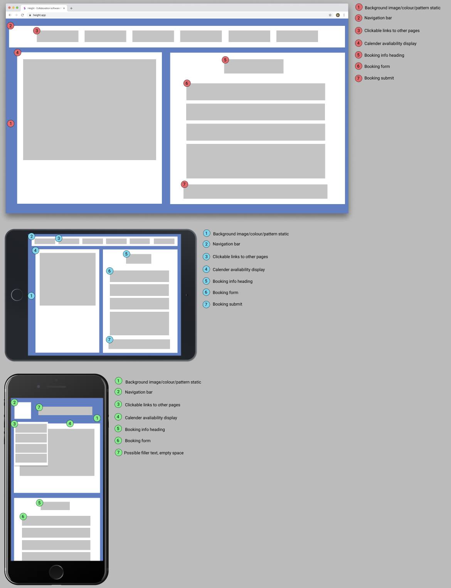
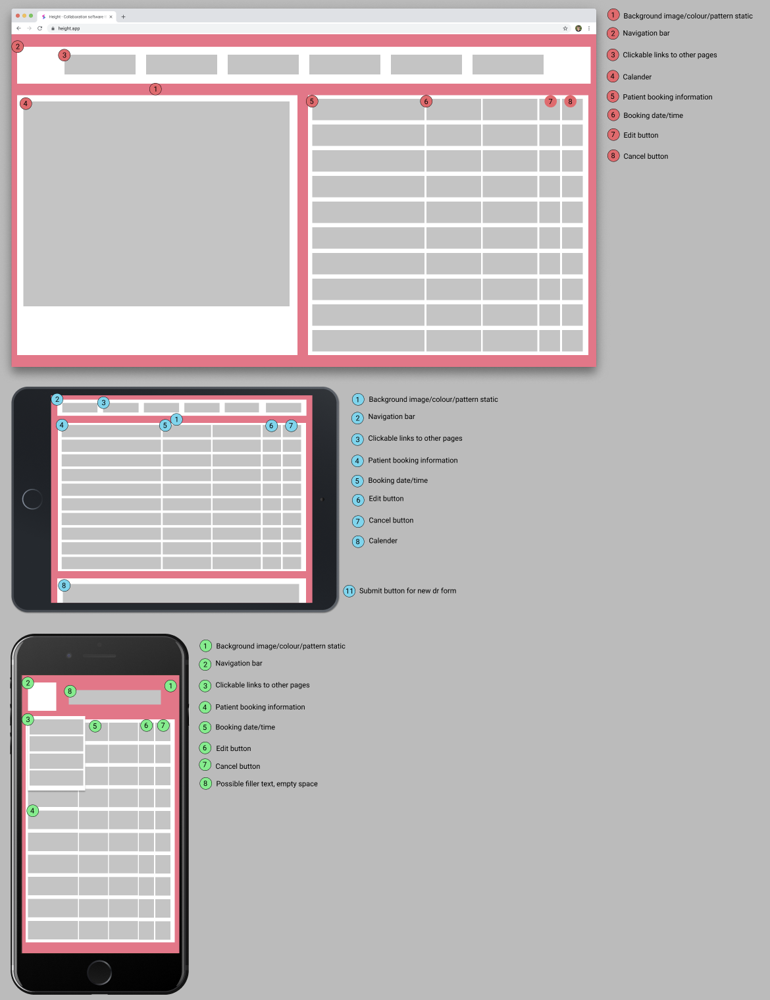
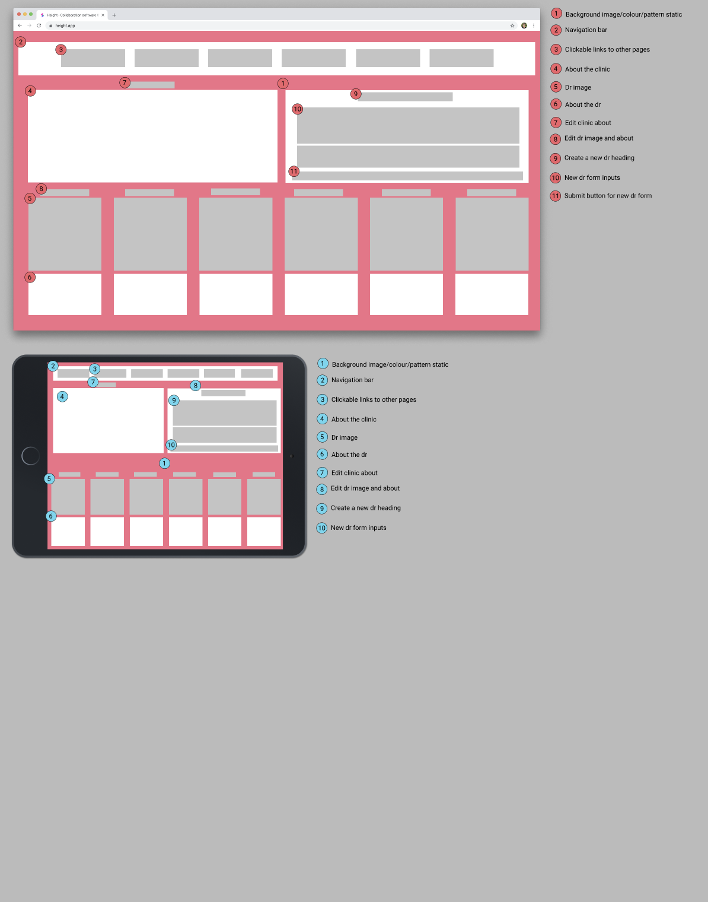

# Real World App

### By Heng CAI, Christopher DALZIEL, Nhan DANG

## R1 - Description of your website

**Purpose**  
The website is for a general practice clinic in Malaysia called Klinik Dr Leong Subang Jaya (Dr Leong's medical clinic). It is a fairly new medical clinic opened in early 2019 that does not have a website up and running yet. Currently, the clinic uses a Facebook page to provide information such as opening hours and contact information for patients.

The website is intended to be used to replace the Facebook page as the main source of information about the clinic. It is intended to be used by both clinic staff and patients. For patients, the site can be used to view information about the clinic including the staff information, opening hours, contact information and

- Functionality / features
- Target audience
- Tech stack

# Wireframes

#### Home Page

#### About The Clinic Page

#### Patient Sign Up Page

#### Patient Profile Page

#### Make A Booking Page

#### Contact Clinic Page

#### Admin Booking Management Page

#### Admin Edit Clinic Information Page

